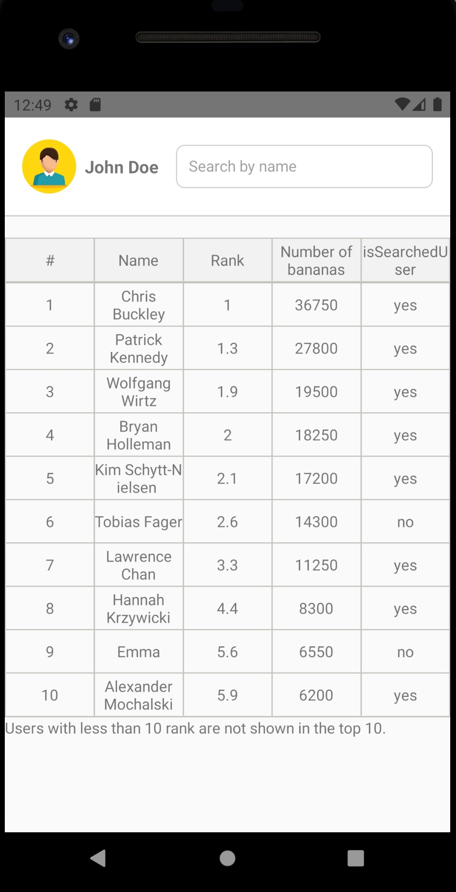
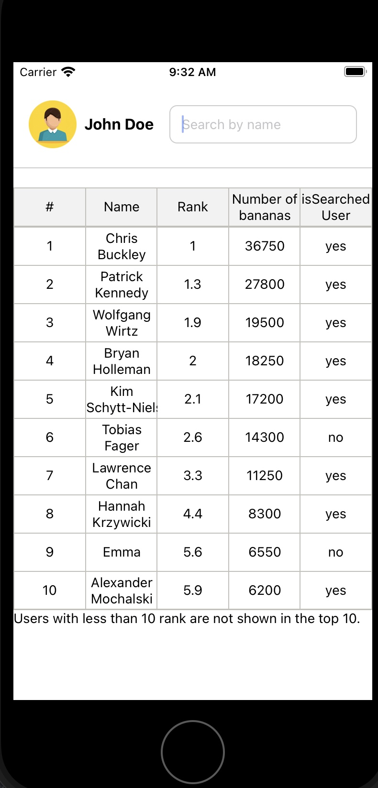

# BananaRank App

<div style="display:flex; width:500px; margin: 0 auto; margin-bottom:50px">

<br />
</div>
BananaRank is a React Native mobile application that displays a leaderboard of users based on their banana counts in a gaming app. Users can search for specific users by name and view their rankings.

## Installation

Follow these steps to set up and run the BananaRank app:

1. **Clone the repository:**

   ```bash
   git clone https://github.com/yourusername/BananaRank.git
   cd BananaRank
   ```

2. **Install dependencies:**

```bash
npm install
```

3. **stars the development server:**

```bash
Start the development server
```

4. **Run the emulators:**

```bash
npx react-native run-android # For Android
# OR
npx react-native run-ios # For iOS

```

NOTE: make sure you run `pod install --repo-update` in `ios` folder before running ios, 
and you install all gradle dependencies similarly, you can use android studio for auto installation. 
these are important steps before running android or ios

# Usage

Once the app is running, you can use it as follows:

- Open the BananaRank app on your emulator or device.
- You will see a leaderboard displaying the top 10 ranked users based on their banana counts.
- Use the search bar at the top to search for specific users by name. The search is case-insensitive.
- If a user is not found by name, an error message will be displayed: "This user name does not exist! Please specify an existing user name!"
- Users with more than 10 bananas will not be shown in the top 10 but will be mentioned at the end of the leaderboard.

# Dependencies

The BananaRank app relies on the following dependencies
`react-native-elements` for UI components.
`react-native-responsive-screen` for responsive layout design.
`react-native-table-component` for rendering table layout.

# Tests

```bash
npm run test
```
